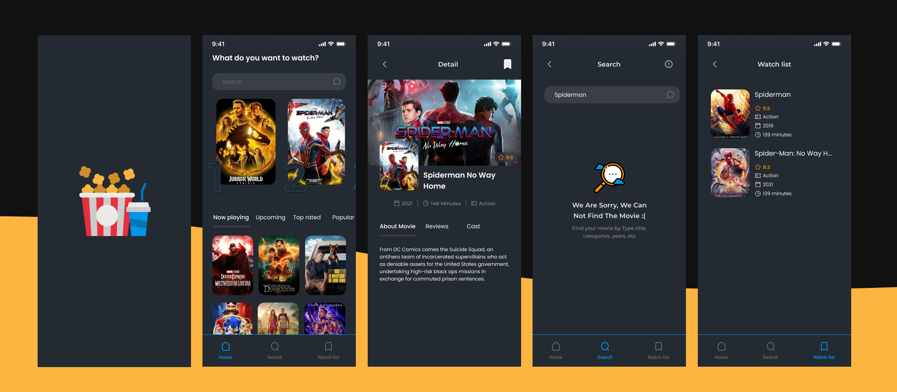

<div align="center"><h1> Movies App</h1>

An application can help users discover new movies that they may enjoy.

</div>

## About the project



## Features

- Get trending movies list for the day
- Get popular, upcoming and top rated movies
- Search movies by title
- Discover movies by genres
- Get cast's details
- Get movie's details
- Watch trailer of movies
- Make your watchlist and favourites

## Technologies Used and Dependencies

- React Native Expo
- react-native-vector-icons
- react-native-dotenv - API_KEY
- react-native-svg
- styled-components
- [TMDb](https://www.themoviedb.org/) API (The Movie Datebase)

## Installation

1. Clone the repo

```sh
git clone https://github.com/nada-abuzaid/Movies.git
```

2. Download the project then run following commands.

```sh
npm install
```

3. Add .env variables

> You will need API key to fetch the movies data from TMDb, so get your API key from there then make a .env file in the project directory and write as in the .env.example file

4. Run the project - Android

```sh
npm run android
```
